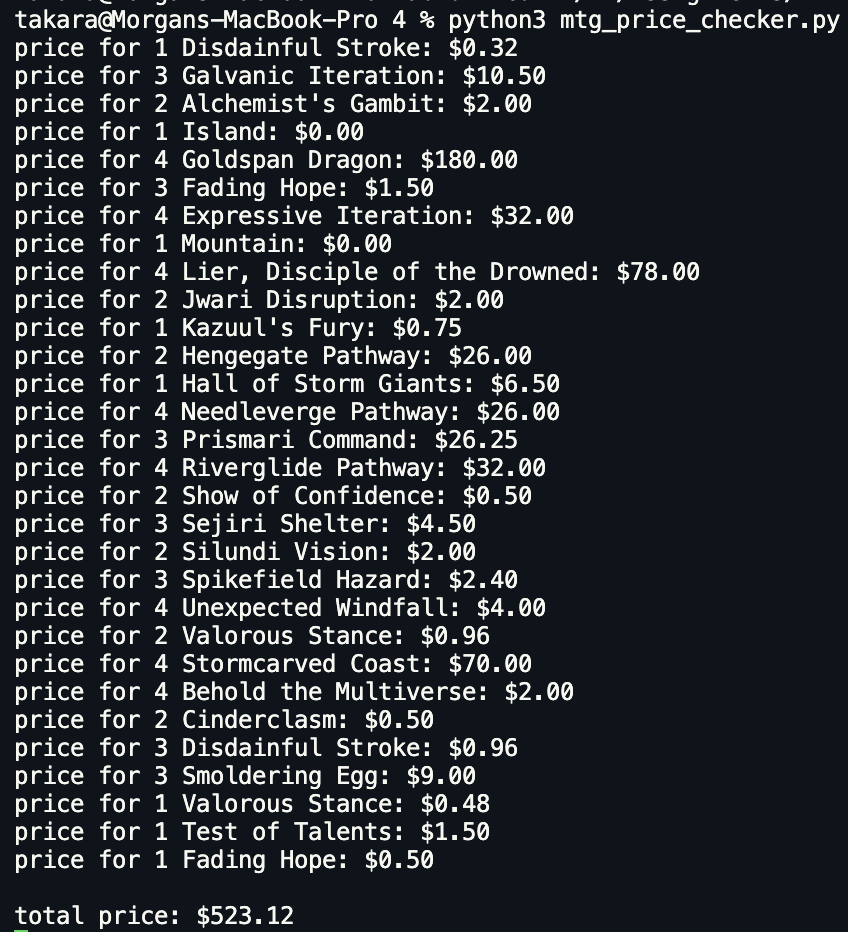
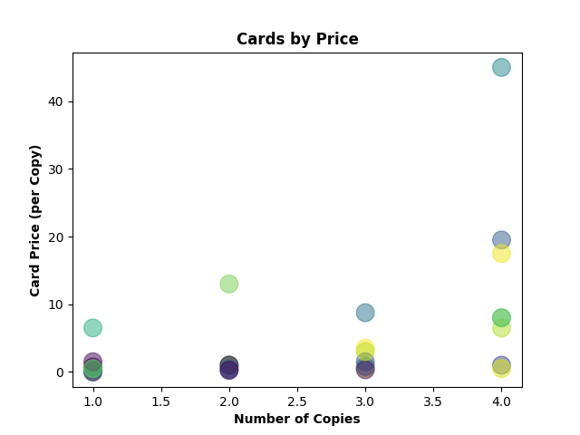

# Magic: the Gathering Price Checker

## Program Summary

Many Magic: the Gathering (MTG) players are concerned about the prices of cards, especially because card prices are arbitrary, fluctuate widely, and change often. For example, card prices tend to range from $0.25 to $50.00 or more, with some worth hundreds or even thousands of dollars, and a card that costs $1.00 today could cost $20.00 next month, or vice versa.

This program is an example of a tool that MTG players could use to efficiently price out a list of cards without having to manually look up each one, a process that can be very time-consuming if they’re interested in the prices of many different cards.

The program pulls data from two different sources on the web:

1. **MTG Goldfish (https://www.mtggoldfish.com)**  
    This site contains lists of cards for many popular MTG decks, which can be downloaded as plain text files. The site also shows card prices; however, this data is American and the prices are in USD. There is no existing service (that I know of) which shows popular decks and their prices in Canadian dollars.

2. **Wizard’s Tower (https://www.kanatacg.com)**  
    This is a Canadian online store that sells MTG cards and related products. We can search this site for any card based on the card’s name, and the top result will return the current sell price for that card.

## Program Outline (Pseudocode)

1. Read in the deck list from MTG Goldfish — this is a plain text file following the format: # Card Name (e.g. 4 Goldspan Dragon, if there are 4 copies of a card named “Goldspan Dragon”), with a different card on each line.

2. Organize the data into a dataframe with card names in one column and counts in another column.

3. For each card in the list:

    1. Check if the card is a basic land (i.e. if the name is “Island”, “Mountain”, “Plains”, “Swamp”, or “Forest”). These cards are always priced at $0.00.

    2. If not a basic land, search Wizard’s Tower for the card name, and save the search result page to a dataframe (this is a web table).

    3. All search result pages are identical, so the price for the top result will always end up in the same cell of the dataframe. This can be found through testing, by printing first the entire dataframe, then smaller and smaller parts of it, until we’ve isolated the data we want, which happens to be in df[2][1][0][5:]. Convert this value to a float, multiply it by the card count, and that is the price.

    4. Output the card name, count, and price to the screen.

4. Save the individual card prices to the deck list dataframe in a new ‘price’ column.

5. Create one more column in that dataframe called ‘price_each’ — this is a calculated column that contains the price for just _one_ copy of each card (the first price column contains the price for _all_ copies).

6. Calculate and output the total price for all cards in the list.

7. Display a scatter plot showing how many copies there are for cards at each price point — a nice, visual overview of how many expensive vs. cheap cards are in the list.

## Example Output

## Areas for Improvement

1. **Better output format.** The current program outputs the price for each card as they are looked up, in no particular order. It could instead sort the dataframe, then output the cards from most expensive to least expensive, or vice versa, or in alphabetical order.

2. **Allow users to input their own card list.** Because this program is just an example, it only looks up prices for one particular deck, with the link to that deck list hardcoded in. The program can easily be modified so that users can input a link to any deck, or even a text file on their computer. They could then use the program to price out their entire collection if they want.

3. **Output results to a file.** The program can easily be modified to save the final resulting dataframe to a csv file, which would be more useful than just printing the results on screen.

4. **Look up prices from Face to Face Games (https://www.facetofacegames.com) instead of Wizard’s Tower.** This is the ideal solution, as Face to Face Games is the largest store in Canada for MTG products, and many local shops match their prices. However, this solution is complicated. Because their website uses a search API, card prices cannot be scraped from search result pages. The only way to scrape the price for a card is from its product page. In order to generate the url for a card’s product page, we need to know the card name and set name for some cards, or the card name, set name, and collection number for others. This can be done in either of two ways: having the user input that information as part of the card list file, or connecting to a card database. Neither of those options is ideal — the first requires more work from the user, and the second can run into complications when dealing with cards that have multiple printings. This modification would require a significant amount of work.